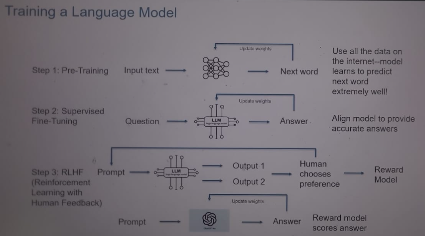

# Training a Language Model – ChatGPT Notes

This document summarizes how ChatGPT is trained, starting from its neural network foundation and moving through the four main stages of training.

---

## 🧠 Model Architecture and key Components

### 1. Large Language Model (LLM)
- A type of neural network trained on massive text data.
- Learns to predict and generate human-like language.
- Examples: ChatGPT, Copilot, Claude.

### 2. Neural Network
- A computational model inspired by the human brain.
- Made of layers of interconnected nodes (neurons).
- Learns patterns and makes predictions by adjusting internal parameters.

### 3. Transformer Model
- A neural architecture designed for sequential data (like text).
- Uses attention mechanisms to focus on relevant parts of input.
- Core to modern tools like ChatGPT and Copilot.

### 4. Weights
- Internal parameters of a neural network.
- Tuned during training to improve accuracy.
- After training, weights are fixed and used to generate predictions.
- Summary: It is a model parameter, adjusted during training to minimize the difference between predicted and actual outputs.

### 5. Tokens
- Units of text (words or word parts) processed by the model.
- All input and output is handled as tokens.
- Token limits define how much content the model can handle at once.

---

## 🧠 Overview of Training Phases

### 1. Pre-Training
- **Objective**: Teach the model to predict the next word in a sentence.
- **Method**: Feed massive amounts of internet text.
- **Process**:
  - Input: Raw text data.
  - Model: Neural network processes the input.
  - Output: Predicts the next word.
- **Action**: Update internal parameters (weights) based on prediction accuracy.
- **Main Outcomes**:
  - Learns to predict the next word *extremely well*.
  - Learns grammar, facts, and general language patterns that form the foundation for later capabilities.

---

### 2. Supervised Fine-Tuning
- **Objective**: Align the model to give accurate and helpful answers. Here model is trained on labeled data, and learns to map inputs tp outputs.
- **Method**: Questions with correct answers are feeded to the model.
- **Process**:
  - Input: Specific questions.
  - Model: Generates answers.
  - Human: Provides correct answers as reference.
  - Action: Update weights to make the model smarter and closer to desired outputs.
- **Main Outcomes**:
  - Learns to follow instructions more effectively.
  - Produces clearer, more accurate, and context-aware answers.

---

### 3. Reinforcement Learning with Human Feedback (RLHF)
- **Objective**: Optimize responses based on human preferences.
- **Method**: Compare multiple outputs and reward the best one.
- **Process**:
  - Input: Prompt.
  - Model: Generates multiple answers.
  - Human: Selects the best answer among them.
  - Reward Model: Trained using these human preferences.
  - Later: The reward model replaces human judgment, automatically scoring outputs.
- **Main Outcomes**:
  - Prioritizes helpful, safe, and aligned responses.
  - Learns to adapt to human values and preferences.
  - Builds a reward model that scales human judgment into automated evaluation.

---

### 4. Finalization
- **Objective**: Produce the finished ChatGPT model.
- **Method**: Weights are updated one last time.
- **Main Outcome**: This final update gives us ChatGPT, ready for deployment.

---

## ⚙️ Core Architecture

- **Transformer blocks**: Use attention mechanisms to focus on relevant words in context.
- **Positional encoding**: Helps the model understand word order.
- **Multimodal capability**: Latest versions (e.g., GPT-4o) can process text, images, and audio.

---

## 🎯 Why This Matters

This layered approach ensures ChatGPT isn’t just parroting text—it learns reasoning patterns, adapts to user intent, and incorporates safeguards to stay aligned with human values.

---

## 📊 Final Summary Table

| Stage                        | Method                                                   | Main Outcomes                                                                 |
|------------------------------|----------------------------------------------------------|-------------------------------------------------------------------------------|
| **Pre-Training**             | Train on massive internet text, predicting next word     | Learns to predict next word extremely well; gains grammar, facts, language patterns |
| **Supervised Fine-Tuning**   | Questions with correct answers are feeded to the model   | Learns to follow instructions; produces clearer, accurate, context-aware answers |
| **RLHF (Human Feedback)**    | Model generates multiple answers; humans select best; reward model trained | Prioritizes helpful, safe, aligned responses; reward model replaces human judgment |
| **Finalization**             | Weights updated one last time                           | Produces the finished ChatGPT model, ready for deployment |
