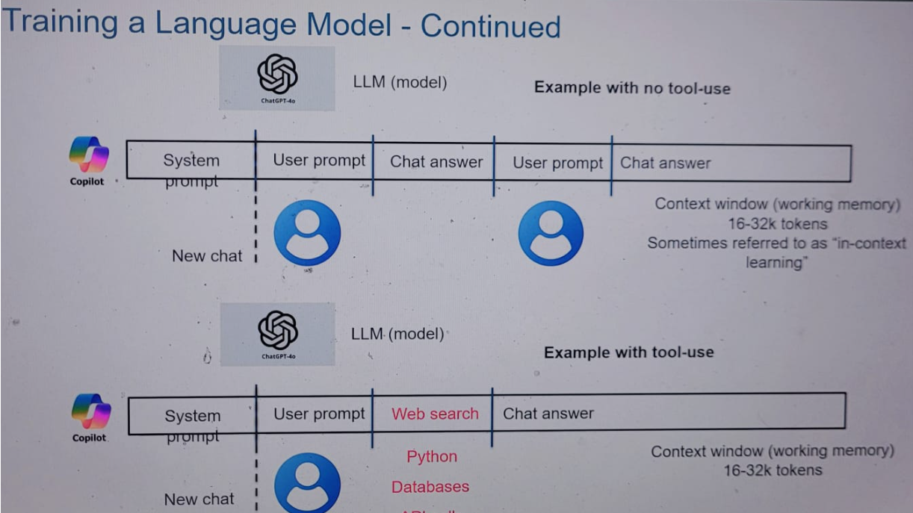

# Working of Copilot

This document explains how Microsoft Copilot works, how it uses language models, and how it differs from ChatGPT.

---

## 🧩 Key Components

### 1. System Prompt
- Hidden default instructions given to the model before user interaction.
- Defines tone, style, safety rules, and behavior.
- Ensures Copilot always responds clearly, politely, and safely.
- Not only co-pilot rather every LLM uses system promt as its intial sets of instruction.
- **Important:** you can not change the system prompt — it’s set by Microsoft to enforce safety, style, and behavior. Instead, you put your rules into your user prompt **(or a .md file you paste in as part of your request)**. Copilot will combine your instructions with its system prompt and generate code accordingly. Example:
 
```markdown
Please generate Python code with these rules:
- Output must follow this format: [function definition + docstring + test cases]
- Cover all edge cases (e.g., empty input, invalid types).
- Error handling must use try/except with custom error messages.
- Add comments for each major step.
```

### 2. User Prompt
- The input typed or spoken by the user.
- Example: *“Explain Kubernetes in simple terms.”*

### 3. Combined Input
- System prompt + user prompt are combined and sent to the language model.
- This ensures the model follows rules while answering the user’s request.

### 4. Tokens
- Text is broken into small chunks called **tokens** (word pieces).
- The process works in **three steps**:
  1. **Tokens are created** from the combined input (system + user prompt).  
    - the inout text is broken down into small chunks called tokens. 
    - Example: “Kubernetes” → “Ku”, “ber”, “netes”.
  2. **Model processes tokens** and predicts the next token, one by one, based on combined input and the context window.
    - This prediction is based on: The knowledge stored in the trained weights (what the model learned during training).
  3. **Predicted tokens are stored inside the context window** so the model can use them for consistency.  
  4. **Predicted tokens are stitched back** After context window is applied, the predicted tokens are stitched back into words and sentences — this is the **output** you see.  
  

### 5. Context Window
- The context window is like a temporary memory.
- It holds all the tokens from the current conversation (system prompt + user prompt + past exchanges).
- Copilot uses this temporary memory to stay consistent in a conversation.
- When predicting the next token, the model looks at everything inside the context window to stay consistent.
- Sometimes called as in-context learning (with working memory of 16-32K tokens). Example: If earlier you asked about Kubernetes, Copilot remembers and connects answers.
- Important: The models are fixed, after training it does not learn new information except throug the context window.
- Modern Copilot models can handle thousands of tokens in the context window.


### 6. External Tools
- Co-pliot and similar tool can use external tool to pull up additional context, like: **web search, APIs, and app connectors**.
- Especially for questions which training data does not cover (e.g., today’s weather, latest news, files from OneDrive).
- This is the main way how copilot is differnt than chat gpt.

---

## 🎯 Simple Flow

**System Prompt → User Prompt → Combined Input → Tokens (create → predict → stitch) → Context Window builds short‑term memory → Answer → External tools (if needed).**

---
## 🖼️ Visual Flow 


---

## 📊 Copilot vs ChatGPT

 - If you ask *4 × 4*, ChatGPT will answer **16** because it was part of its training data. With more complex numbers, it might guess correctly or hallucinate when it doesn’t know. 
 - Copilot on other hand uses external tools like python, for simple questios like 4*4 copilot will answer from its trainnig. For complex calculation it uses tools like Python to get the correct result and give the right output.

 ---
